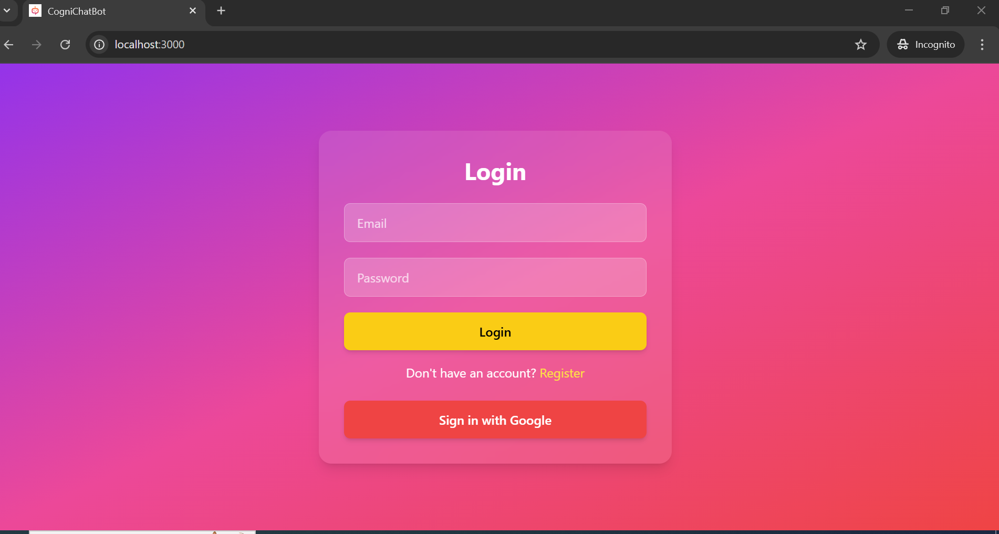
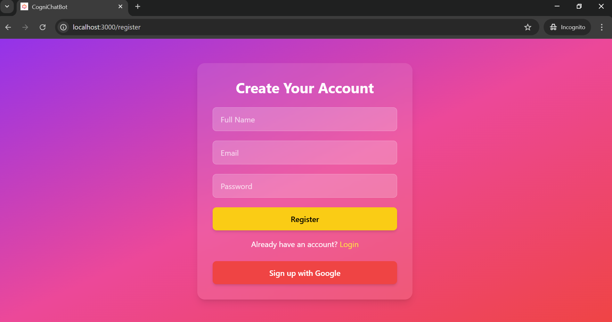
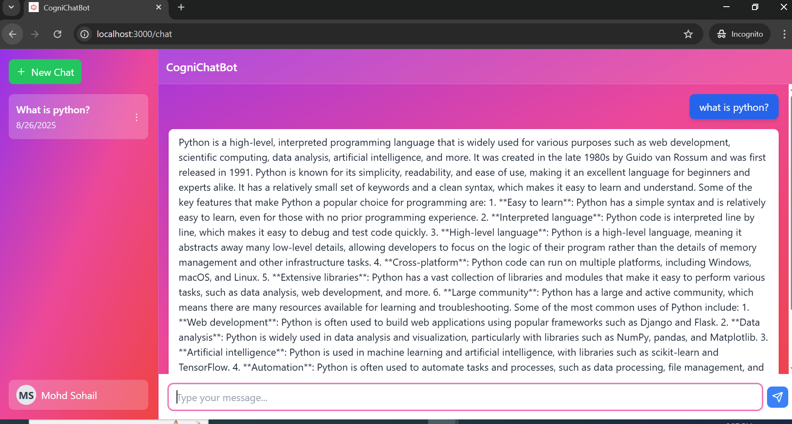
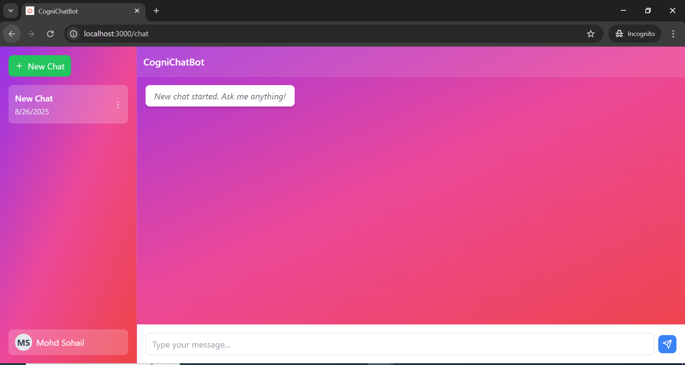
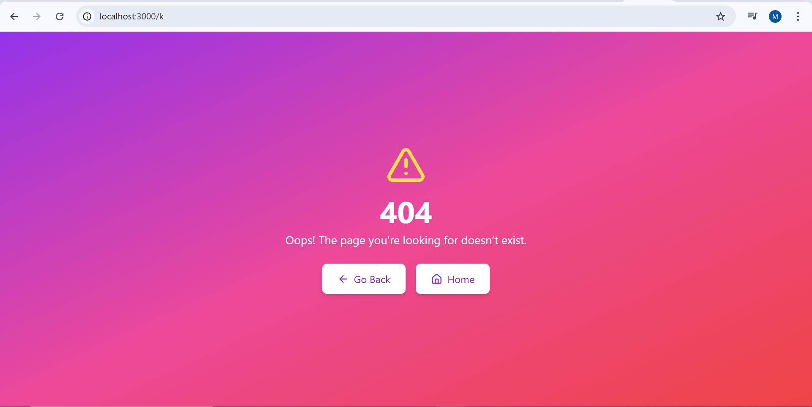

# 🤖 CogniChatBot

CogniChatBot is a full-stack AI chat application built with **React, Node.js, Express, Sequelize (SQLite)** and **Supabase Google Auth**.  
It allows users to register/login (manually or via Google), create/manage chat sessions, and stream AI responses with a real-time **typing indicator**.

---

## ✨ Features

- 🔐 **User Authentication** (Manual + Google OAuth via Supabase)
- 💬 **AI Chat Streaming** with live typing effect
- 📂 **Chat Management** (Create, Rename, Delete, Share)
- 🧾 **Persistent Conversations** stored in SQLite via Sequelize
- 📱 **Responsive UI** with TailwindCSS
- 🎨 **Custom Project Logo + Favicon**
- 🚫 **404 Page** (with Home + Back buttons)

---

## 🛠️ Tech Stack

**Frontend**  
- React + React Router  
- Axios (API calls)  
- TailwindCSS  
- React Hot Toast (notifications)  

**Backend**  
- Node.js + Express  
- Sequelize (SQLite)  
- Groq API (for AI responses)  
- JWT Auth  

**Other**  
- Supabase (Google OAuth)  
- EventSource / Fetch Streaming  

---

## ⚙️ Installation

### 1. Clone the repo
```bash
git clone https://github.com/Mohdsohail7/CogniChatBot.git
cd cognichatbot
```

## 2. Install dependencies
### Install root (for concurrently)
npm install

### Install backend
cd backend
npm install

### Install frontend
cd ../frontend
npm install

## 3. Setup environment variables
Backend (backend/.env)
```bash
PORT=4000
JWT_SECRET=
FRONTEND_ORIGIN="http://localhost:3000"

DB_NAME=postgres
DB_USER=""
DB_PASSWORD=
DB_HOST=""
DB_PORT=5432
SUPABASE_URL=""
SUPABASE_SERVICE_ROLE_KEY=""

GROQ_API_KEY=""

GOOGLE_CLIENT_ID=""
GOOGLE_CLIENT_SECRET=""
```

Frontend (frontend/.env)
```bash
REACT_APP_BASE_URL="http://localhost:4000/api"
REACT_APP_GOOGLE_CLIENT_ID=""
REACT_APP_SUPABASE_URL=""
REACT_APP_SUPABASE_PUBLIC_KEY=""
```

## 🚀 Usage

Register manually or sign in with Google.

Create a new chat and send a message.

AI replies are streamed with a typing indicator.

Rename, share, or delete chats from the sidebar.

## 📸 Screenshots

### 🔐 Login Page and Registration



### 💬 Chat Interface


### 📂 Sidebar & Chat Management


### 🚫 404 Page


🤝 Contributing If you want to contribute or add new features, feel free to submit a pull request! 😊

If you like this project, don't forget to give it a ⭐! 😃

🛡️ License

This project is licensed under the MIT License.

